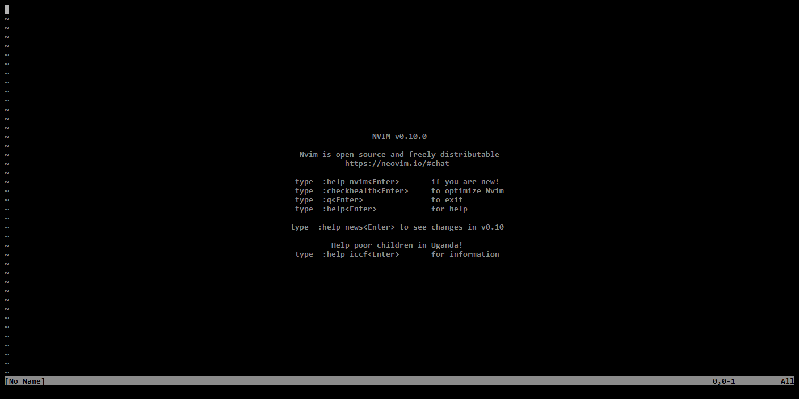

# Game of Life

This plugin implements a zero-player game: [game of life](https://en.wikipedia.org/wiki/Conway%27s_Game_of_Life).

## Sample



## Reason of existance

I have written this plugin just for the sake of learning - treat it accordingly! :)

The plugin lacks a lot of features, but roughly implements the following configurations:

- [x] Block
- [x] Beehive
- [x] Loaf
- [x] Boat
- [x] Tub
- [x] Blinker
- [x] Toad
- [x] Beacon
- [x] Pulsar
- [x] Pentadecathlon
- [x] Glider
- [x] Light-weight spaceship
- [x] Middle-weight spaceship
- [x] Heavy-weight spaceship

## Installation

### [lazy.nvim](https://github.com/folke/lazy.nvim)

```lua
{
    "csombi/game-of-life.nvim",
    dependencies = { 'MunifTanjim/nui.nvim' }
}
```

The plugin does not accept any configuration.
The menu is created using [nui.nvim](https://github.com/MunifTanjim/nui.nvim/tree/main).